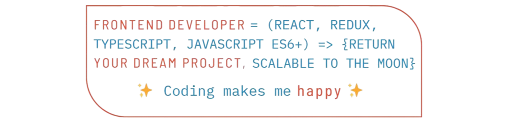

      
<h1></h1>

## 💫 About Me
* 🌍  I'm based in Minsk, Belarus.
* 👨‍💻️  Experienced frontend developer, brimming with curiosity and a knack for learning, adapting, and evolving. Ready to embrace challenges to enhance my software development skills.
* 💼  Check out my resume in English or Russian at <a href="https://veluat.github.io/portfolio-app" target="_blank"><b>my portfolio website</b></a>
* 📚  I'm learning something new every day.
* 🤝 Open to New Projects and Collaboration. Let's create something amazing together!
* 📫 **How to reach me:** j.popova.dev@gmail.com

## 🌐 Socials        

      
<h2>:clipboard: My projects</h2>

      <ul>:bookmark: <b>React app:</b>
            <li>
                  <a href="https://github.com/veluat/dual-counter-app">Dual Counter</a>
            </li>
            <li>
                  <a href="https://github.com/veluat/task-manager-app">Task Manager</a>
            </li>
            <li>
                  <a href="https://github.com/veluat/social-network-app">Social Network</a>
            </li>
            <li>
                  <a href="https://github.com/veluat/weather-matter-app">Weather Matter</a>
            </li>
      </ul>
      <ul>:bookmark: <b>Layouts:</b>
            <li>
                  <a href="https://github.com/veluat/pizza-ordering-layout">Интернет-магазин по заказу пиццы</a>
            </li>
            <li>
                  <a href="https://github.com/veluat/taxi-services-layout">Taxi Services</a>
            </li>
            <li>
                  <a href="https://github.com/veluat/digital-art-layout">Digital Art & NFT Marketplace</a>
            </li>
      </ul>

## :sparkling_heart: My Fav Dev Tools
<table>
      <tbody>
            <tr>
                  <td align="center" width="90">
                         <b>JavaScript</b>
                  </td>
                  <td align="center" width="90">
                         <b>React</b>
                  </td>
                  <td align="center" width="90">
                         <b>Redux</b>
                  </td>
                  <td align="center" width="90">
                         <b>TypeScript</b>
                  </td>
            </tr>
      </tbody>
</table>

      
<h2>🛠 My Tech Stack & Tools</h2>

      

            
            
            
            
            
            
            
            
            
            
            
            
            
            
            
            
            
            
            
            
            
            
            
            
            
            
            
            
            
            
            
            
            
            
            
            
            
            
            
            
            
            
      

## 📊 GitHub Stats

 

      
      

 

      
      

